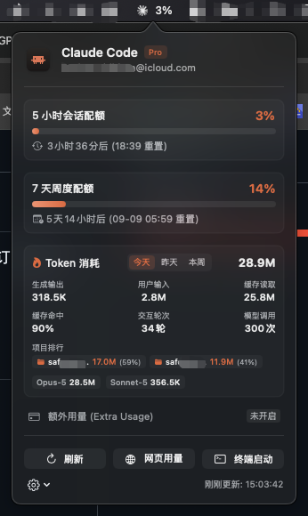

# ClaudeBar ✳️

**ClaudeBar** 是一款专为 macOS 设计的极轻量原生菜单栏小工具，用于实时监控并展示 **Claude Code** 的当前订阅配额与重置时间。

纯原生 Swift + SwiftUI 编写，内存仅占用 ~30MB，无需 Electron、Python 或 Node.js 等运行时依赖。

## 📸 产品预览

<p align="center">
  
</p>

---

## ✨ 特性

- ✳️ **官方质感图标**：
  - **菜单栏图标**：直接提取自 Anthropic 官方 Claude 应用的 `TrayIconTemplate`，自适应 macOS 浅色/深色主题。
  - **应用程序图标**：使用 Claude Code 官方专属像素小机器人吉祥物（`#D97757` 陶土色），遵循 macOS 标准圆角矩形 Squircle 设计。
- 📊 **实时双额度监控**：
  - **5 小时会话用量（5-Hour Session Limit）**：动态彩色进度条与百分比。
  - **7 天周度用量（7-Day Weekly Limit）**：累计使用进度。
- 🔥 **多周期 Token 消耗统计与项目排行**：
  - **多时间维度切换**：支持点击切换 **「今天」**、**「昨天」**、**「本周」** 三种时间跨度。
  - **项目消耗排行 (Top Projects)**：展示各项目消耗排名（如 `safetysupervision 17.0M (58%)`）。
  - **全方位细分**：
    - **生成输出**：大模型实际生成的输出 Token 数（如 `318.5K`）。
    - **用户输入**：输入到模型的提示词与上下文 Token 数（如 `2.8M`）。
    - **缓存读取**：从 Prompt Caching 重复读取的 Token 数（如 `25.8M`）。
    - **缓存命中**：缓存读取占全部输入的比例（如 `94.5%`）。
    - **交互轮次**：统计当天用户实际提问的交互轮数（如 `180轮`）。
    - **模型调用**：统计大模型 API 响应与工具循环的总调用次数（如 `300次`）。
  - **主力模型分布**：展示当天主要调用的模型分布（如 `Opus 5`、`Sonnet 5`）。
- 🔔 **智能配额预警通知**：
  - 5小时会话配额或7天配额达到 80%、95% 时触发 macOS 原生系统横幅通知，防止意外被限流。
- 🖥️ **全架构支持 (Universal 2)**：
  - 原生支持 Apple Silicon (M1/M2/M3/M4) 与 Intel 架构，最低支持 macOS 12.0+。
- ⏳ **精确本地倒计时**：
  - 将 API 返回的 UTC 重置时间自动换算为本地时区倒计时（如 `1小时45分后 (13:29) 重置`）。
- 💳 **额外用量状态**：
  - 显示额外充值额度（Extra Usage）是否启用以及当前消费金额。
- 🪶 **原生极简**：
  - 纯后台 Accessory 小程序（`LSUIElement = true`），不占用 Dock 栏与 Cmd+Tab 切换列表。
  - 支持快捷操作：立即刷新、打开 Claude 网页用量详情、一键在终端打开 Claude Code。
  - 设置项：支持勾选「开机自动启动（`SMAppService`）」以及「仅显示图标 / 显示百分比」。

---

## 🛠️ 工作原理

```
[Claude Code CLI 登录]
          │
          ▼
macOS 系统钥匙串 Keychain ("Claude Code-credentials")
          │
          ▼
ClaudeBar 自动提取 OAuth AccessToken
          │
          ▼
请求 Anthropic 官方接口: https://api.anthropic.com/api/oauth/usage
  （若断网或令牌失效，自动降级读取 ~/.claude.json 本地缓存）
          │
          ▼
更新 macOS 菜单栏实时配额 & SwiftUI 毛玻璃详情卡片
```

---

## 🚀 安装与编译

### 环境要求
- macOS 12.0 或更高版本（支持 Apple Silicon 与 Intel）
- Xcode Command Line Tools（系统自带 `swiftc`）

### 编译与一键安装到应用程序

```bash
git clone https://github.com/TangYifu/ClaudeBar.git
cd ClaudeBar

# 一键编译并安装到 /Applications/ClaudeBar.app
./build.sh --install

# 启动应用
open /Applications/ClaudeBar.app
```

---

## 📂 项目结构

```
ClaudeBar/
├── Sources/
│   ├── main.swift                 # 应用启动入口 (@main)
│   ├── AppDelegate.swift          # NSStatusItem 菜单栏图标与事件生命周期管理
│   ├── PopoverView.swift          # SwiftUI 毛玻璃弹窗详情面板
│   ├── ClaudeUsageService.swift   # Keychain 凭据读取与 Anthropic API 交互服务
│   ├── SettingsManager.swift      # 用户偏好与开机自启动设置 (SMAppService)
│   └── Models.swift               # 数据模型定义
├── Resources/
│   ├── AppIcon.icns               # Claude Code 官方像素吉祥物 macOS 软件图标
│   ├── TrayIconTemplate*.png      # 官方自适应菜单栏星芒图标 (1x/2x/3x)
│   └── claudecode-color.svg       # 官方矢量源文件
├── Info.plist                     # 应用属性列表 (LSUIElement = true)
├── build.sh                       # 编译与安装打包脚本
└── generate_icon.swift            # 1024x1024 AppIcon 生成脚本
```

---

## 📄 开源许可

本项目基于 [MIT License](LICENSE) 协议开源。
